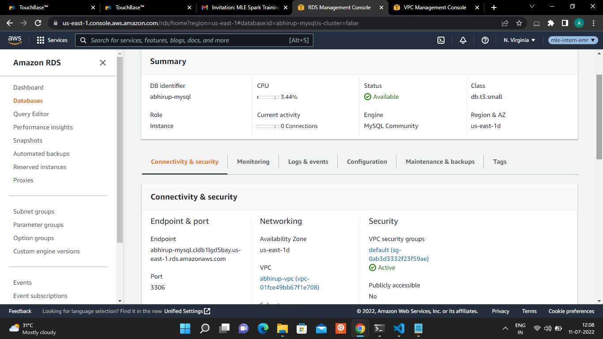

# **Deploy a Flask App in Autoscaling Group**

## Create a VPC with one private and public subnet. 
I. Create VPC
- Login to AWS management console and navigate to the VPC console and click on "Create VPC".
- Enter VPC CIDR details, leave the remaining settings as it is and click "Yes, Create" button.

II. Create Public Subnet
- Make sure to select *your-VPC* under VPC drop down menu and enter IPv4 CIDR block for public subnet.

III. Create Private Subnet
- Create Private subnet with CIDR block.

IV. Create and Attach Internet Gateway
- Create and Attach Internet Gateway to *your-VPC*.
- Once created, it will be in "detached" status. We need to attach it to the VPC.
- Now, *your-IG* status will turn into "attached".

V. Add a route to Public Subnet
- In order to make the instances created in public subnet internet accessible, a new Route table is created, that will establish connection between public subnet and internet gateway.
- Create a new Route table.
- Select *your-RT*, click on Routes tab and edit.
- Add 0.0.0.0/0 as Destination and click on next, it should list *your-IG*, select it and click on Save.
- Associate *your-RT* with Public subnet *your-PublicNet* and save.

    
<br>

## Create an RDS MySQL in the public subnet of the VPC.
You must have either two private subnets or two public subnets available to create a DB subnet group for a DB instance to use in a VPC.  

Create an Additional Public Subnet
- To add the second private subnet to your VPC, choose VPC Dashboard, choose Subnets, and then choose Create subnet.
- On the Create subnet page, choose the *your-VPC*.
- Set the Subnet name and Availability Zone, then cick on Create Subnet.  


## Connect to the RDS MySQL and create a table "logs".
- The cluster endpoint connects you to the primary instance for the DB cluster. To view the cluster endpoint (writer endpoint), choose Databases on the Amazon RDS console and choose the name of the DB cluster to show the DB cluster details.  

- Create a table named *logs*.  
    
    

## Move the RDS MySQL to a private subnet.
I. Create an in-Region read replica for an Aurora MySQL cluster using the Amazon RDS console
- Discover the IP address of your DB instance, run dig on the DB instance's endpoint to find its underlying IP address.

    ```
    dig <rds-endpoint>
    ```
- From the private IP, you can find which subnet it is using. This is the subnet that your primary instance uses.


II. Remove the public subnets and add private subnets on your DB instance
- Add all required private subnets in the subnet group. Also, delete all public subnets from the subnet group except for the one that is used by your primary.
- Reboot your DB instance with failover. When your DB instance fails over, the secondary, which is using the private IP, becomes the primary and the public subnet becomes the secondary.

III. Remove the public subnet
- Remove the remaining public subnet from the subnet group.
- Check that there are only private subnets present in the subnet group.
  
    


## Create a flask app with a single route which connects to the DB. The app should insert a record with a timestamp into the DB for each API call.

I. Launch and configure your EC2 instance and configure the network setting of the instance 

- Transfer files and run the application
    ```
    scp -i <my-key-pair>.pem -r <SampleFolder> ubuntu@my-instance-public-dns-name:
    ```  

- Install MySQL in Ubuntu 20.04
    Update the package index on your server, install the mysql-server package and ensure that the server is running.
    ```
    sudo apt update
    sudo apt install mysql-server
    sudo systemctl start mysql.service    
    ```  

- Connect Amazon RDS DB instance to MySQL
    The following connects to MySQL
    ```
    mysql -h <cluster endpoint> -P 3306 -u <myusername> -p
    ```

- Create a table named *logs* in the database   

    The folder has only one column, *entry* of the data type *TIMESTAMP*  


- Configure Gunicorn and Nginx


    A file named *gunicorn.service* is created into the */etc/systemd/system directory*. 
    ```
    [Unit]
    Description=Gunicorn service
    After=network.target

    [Service]
    User=ubuntu
    Group=www-data
    WorkingDirectory=/home/ubuntu/flask-app
    ExecStart=/usr/bin/gunicorn3 --workers 3 --bind unix:flask-app.sock -m 007 app:app
    ```
    
    Similarly, into */etc/nginx/sites-enabled* certain modifications are made.  
    ```
    server{
        listen 80;
        server_name 54.174.47.210;

        location / {
          proxy_pass http://unix:/home/ubuntu/flask-app/flask-app.sock;
        }
    }
    ```
  
    The system services need to be reloaded and started by using the following commands:  
    ```
    $ sudo systemctl daemon-reload
    $ sudo service nginx restart
    $ sudo service gunicorn3 restart
    ```


- Run the flask application   

    You can view your live application in your public IPv4Public IP address.  
    The URL would be: "*http://public-ip/*".  
        
        

## Deploy the flask app in an autoscaling group.   
Once EC2 instance is ready, create an AMI using: *Image→Create Image*.
Create an Auto Scaling group using a launch template  
- Choose to Create an Auto Scaling group.
- On the Choose launch template or configuration page, do the following:
    * Enter a name for your Auto Scaling group and choose your VPC. 
    * For Availability Zones and subnets, choose two public subnets in the specified VPC. Use subnets in multiple AZs for high availability.
    * Create a launch template that uses the instance type.

<br>

## Provision an AWS Application load balancer which connects to the Autoscaling group.

Configure an Application Load Balancer from the Amazon EC2 Auto Scaling console  
- Choose to create an Application Load Balancer and enter a name for the load balancer.
- For Load balancer scheme, choose to create a public internet-facing load balancer.
- For Availability Zones and subnets, select the public subnets for each Availability Zone in which you choose to launch your EC2 instances.
- For Listeners and routing, choose to Create a target group. 
- Then choose to add tags to your load balancer and attach the Load Balancer to the Auto Scaling Group.


## Create a Lambda function which scales down the autoscaling group to zero on every Saturday and scales up to 1 on every Monday morning.

I. AWS IAM Role (and its policy)
Go to the IAM section and create a policy
  ```
  {
    "Effect": "Allow",
    "Action": "autoscaling:*",
    "Resource": "*"
 }
 ```

II. AWS Lambda function  

The code for the lambda function is mentioned below:

```
import boto3

client = boto3.client('autoscaling')

def get_env_variable(var_name):
    return os.environ[var_name]


def lambda_handler(event, context):
    auto_scaling_groups = get_env_variable('NAMES').split()

    for group in auto_scaling_groups:
        if servers_need_to_be_started(group):
            action = "Starting"
            min_size = int(get_env_variable('MIN_SIZE'))
            max_size = int(get_env_variable('MAX_SIZE'))
            desired_capacity = int(get_env_variable('DESIRED_CAPACITY'))
        else:
            action = "Stopping"
            min_size = 0
            max_size = 0
            desired_capacity = 0

        print(action + ": " + group)
        response = client.update_auto_scaling_group(
            AutoScalingGroupName=group,
            MinSize=min_size,
            MaxSize=max_size,
            DesiredCapacity=desired_capacity,
        )

        print(response)

def servers_need_to_be_started(group_name):
    min_group_size = get_current_min_group_size(group_name)
    if min_group_size == 0:
        return True
    else:
        return False

def get_current_min_group_size(group_name):
    response = client.describe_auto_scaling_groups(
        AutoScalingGroupNames=[ group_name ],
    )
    return response["AutoScalingGroups"][0]["MinSize"]
```  
The Environment Variables are:
```
  NAMES - Space separated list of the Auto Scaling Groups you want to manage with this function
  MIN_SIZE - Minimum size of the Auto Scaling Group(s) when EC2 instances are started
  MAX_SIZE - Maximum size of the Auto Scaling Group(s) when EC2 instances are started
  DESIRED_CAPACITY - Desired capacity of the Auto Scaling Group(s) when EC2 instances are started
  
  abhirup-weekday
  DESIRED_CAPACITY	2
  MAX_SIZE	2
  MIN_SIZE	1
  NAMES	abhirup-asg

  abhirup-weekend
  DESIRED_CAPACITY	0
  MAX_SIZE	0
  MIN_SIZE	0
  NAMES	abhirup-asg
```


III. AWS CloudWatch Rule
For this purpose, two lambda functions are required, one to start the ASG and the other to stop it. 
The two EventBridge(CloudWatch Events) triggers are:
  ```
  cron (00 06 ? * MON-FRI *)
  cron (00 06 ? * SAT-SUN *)
  ```

  The code is deployed and the function can be tested by hitting the Test button.   

  The capacity is updated.  
    


## Tags used  

 project - *aws-training-emr*  
 owner - *abhirup.sahoo@tigeranalytics.com*  
 team - *mle* 
    
