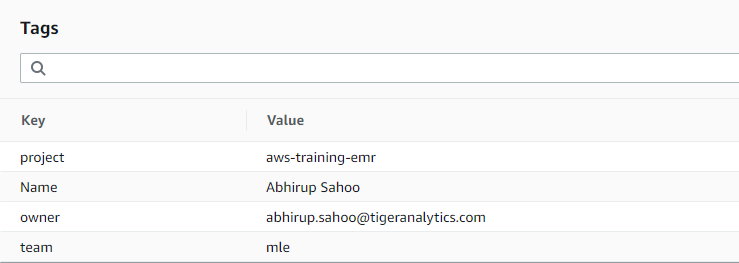
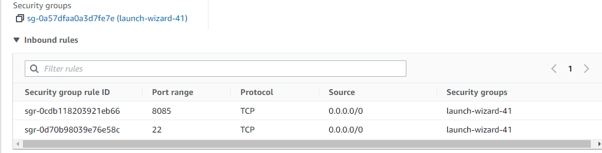
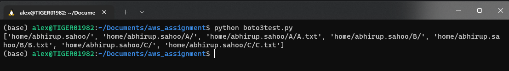
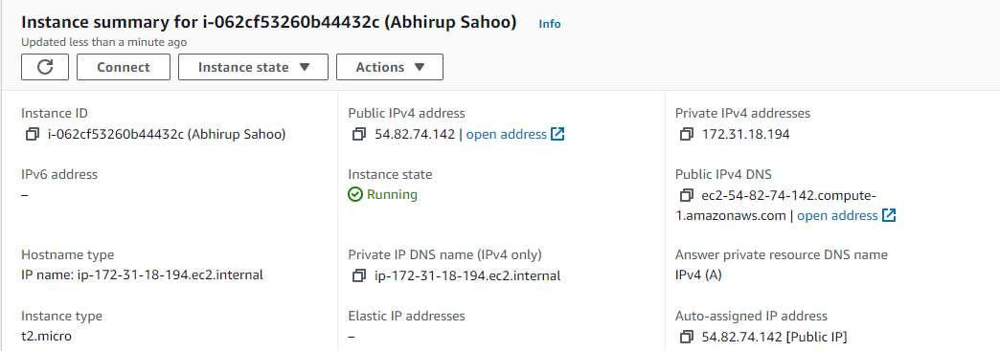
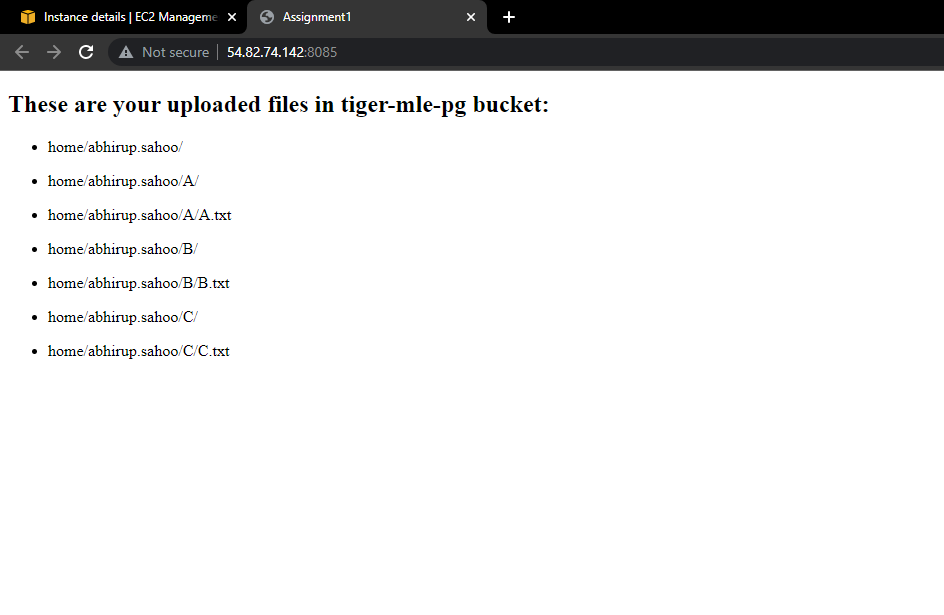

# **Deploy a Flask App on AWS EC2 Instance**

Create a folder *firstname.lastname* inside the S3 location *tiger-mle-pg/home*.  
Create three folders, *A, B, C*, inside the folder  

  


Put in files *A.txt,B.txt,C.txt* inside each of the folders.  
<br>

## Launch an Amazon EC2 instance  
--------------------------------

Launch a Linux instance using the AWS Management Console.  
Make sure to create EC2 instances in the same region where the S3 bucket has been created. 

  

Do not choose Proceed without a key pair. Download the key pair after creating. You can't connect to your instance unless you launched it with a key pair for which you have the *.pem* file and you launched it with a security group that allows SSH access from your computer.
Configure the security group to allow incoming traffic only through 8085.   

  

Check that your instance has passed its status checks. The instance has been launched once the Instance State tab says running along with a green circle.
<br><br>


## Boto3 - The AWS SDK for Python

Boto3 is the Amazon Web Services (AWS) Software Development Kit (SDK) for Python, which allows Python developers to write software that makes use of services like Amazon S3 and Amazon EC2.  

<br>

## Getting Started
------------------

### Boto3 Installation 

```
$ python -m pip install boto3
```

After installing boto3

Next, set up credentials (in e.g. ``~/.aws/credentials``):

```
[default]
aws_access_key_id = YOUR_KEY
aws_secret_access_key = YOUR_SECRET_ACCESS_KEY
```

Then, set up a default region (in e.g. ``~/.aws/config``):
```
[default]
region=us-east-1
```

Using Boto3 for reading the contents of the folder
```
$ python test.py
```

<br>
## Connect to your EC2 instance
-------------------------------
To access the virtual machine created through AWS. Open your terminal and locate the directory with the *.pem* file.
Type `chmod 600 <my-key-pair>.pem` on the command line in your project directory to restrict read and write permissions to the private key file.
In a terminal window, use the ssh command to connect to the instance. You specify the path and file name of the private key (.pem), the user name for your instance, and the public DNS name or IPv4 address for your instance.  
Specify the ssh command with the path to the private key (.pem) file, the appropriate user name, and the IPv4 address.
```
ssh -i /path/<my-key-pair>.pem ec2-user@my-instance-IPv4-address
```
<br>

## Transfer files to Linux instances
------------------------------------
Transfer folder to your instance using the instance's public DNS name. For example, if the private key file is *my-key-pair*, the folder to transfer is *SampleFolder* and the public DNS name of the instance is *my-instance-public-dns-name* to copy the folder to the *my-instance-user-name* home directory.
```
scp -i <my-key-pair>.pem -r <SampleFolder> ec2-user@my-instance-public-dns-name:
```
Locate the directory where your application lives. Create a *requirements.txt* file by entering `pip freeze --local > requirement.txt` into the terminal.  
<br>  

## Deploy the application on EC2 instance
-----------------------------------------
Now that you have your application on the EC2 server, install the requirements for your application.
```
$ pip3 install -r requirements.txt
```
Navigate to the directory. Before running the application, set the environment variable to the file that you want to be your flask application.
```
$ export FLASK_APP=app.py
```
Run the application on port number 8085 by running the following command:
```
$ flask run --host=0.0.0.0 --port=8085
```


You can view your live application by appending 8085 to your public IPv4Public IP address.  
The URL would be: "http://public-ip:8085/".  

<br>



<br>

  